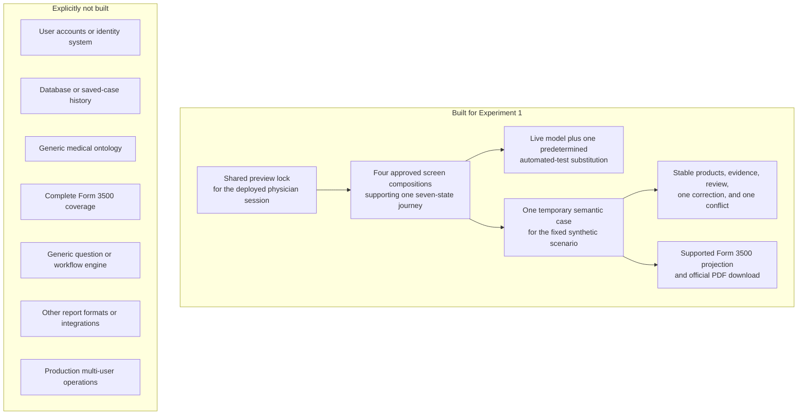
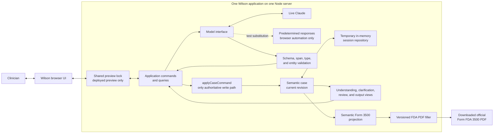
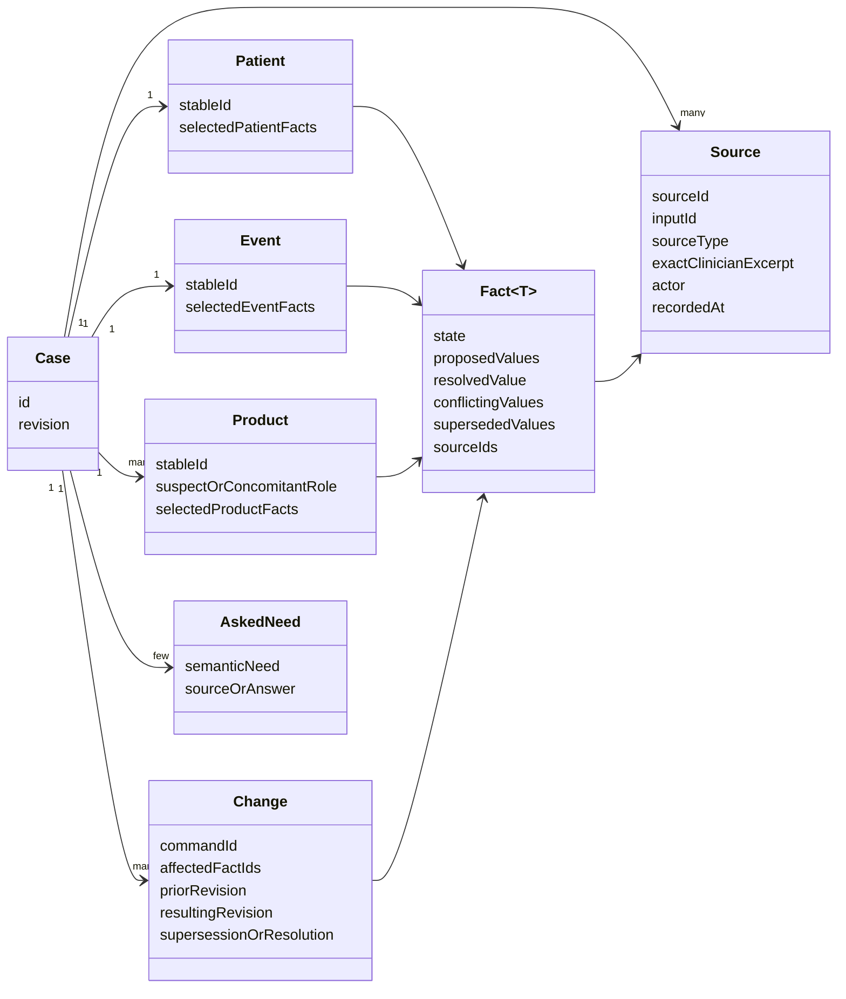
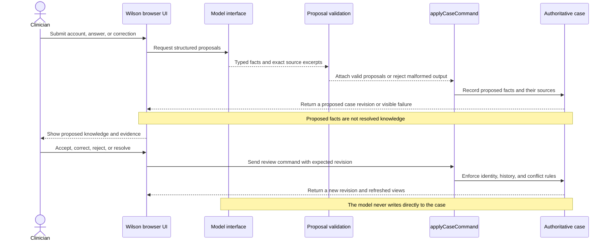
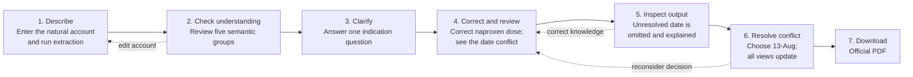
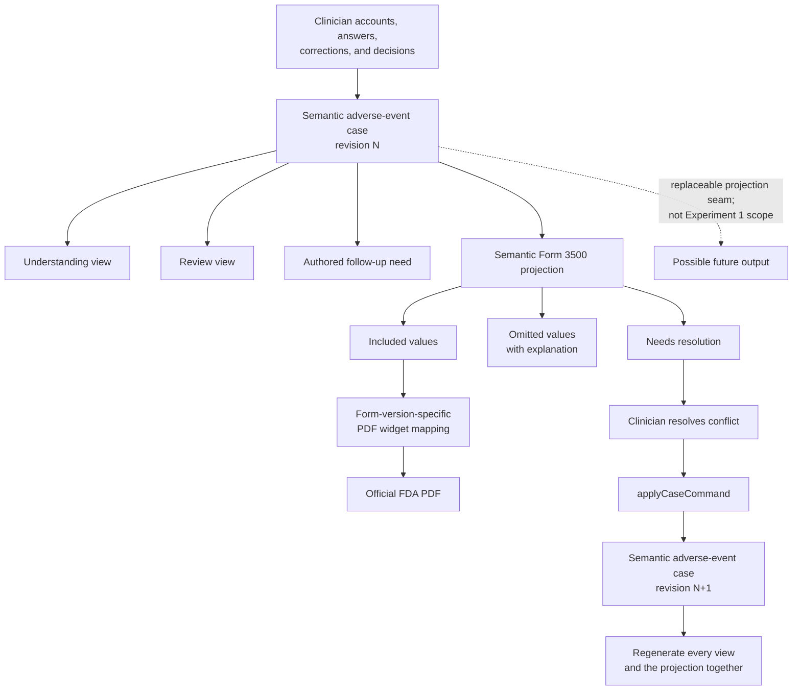
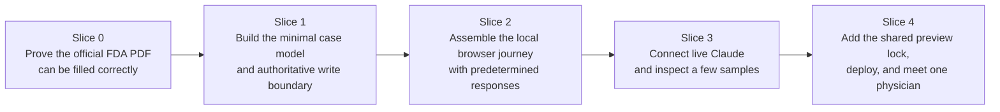
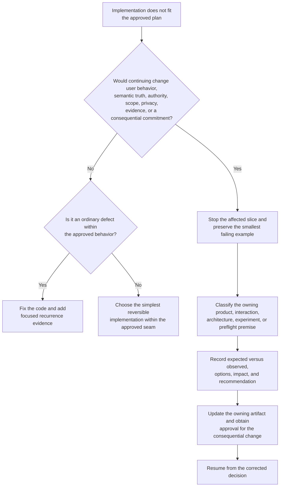
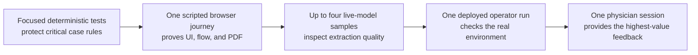

# Wilson Experiment 1 system diagrams

**Status:** Working visual companion to the approved architecture and browser
experiment; not implementation authorization  
**Scope:** The first production-shaped Wilson experiment only  
**Companions:**
[`ARCHITECTURE-PROPOSAL.md`](../product/ARCHITECTURE-PROPOSAL.md),
[`EXPERIMENT-1-PROPOSAL.md`](EXPERIMENT-1-PROPOSAL.md), and the
[`visual checkpoint`](visual-checkpoint/README.md)

These diagrams make the approved boundaries, data model, and major flows easier
to inspect. They do not expand the approved experiment. Solid paths describe
Experiment 1 behavior. Dotted paths identify a test substitution or an
explicitly excluded future possibility.

## Executive summary

Experiment 1 builds one small browser application around a semantic
adverse-event case. The case represents the clinician's knowledge rather than
the fields or widgets of a particular FDA PDF. The model may propose grounded
facts, but it cannot change the case directly or turn a proposal into resolved
knowledge. Every change passes through the command boundary, and resolving
model-proposed knowledge requires clinician review. Review screens,
clarification, and the Form 3500 output are regenerated from the same case
revision.

This is form-independent in a deliberately narrow sense: the domain model does
not contain PDF widget names, page coordinates, checkbox encodings, or a
particular Form 3500 revision. It is still an adverse-event reporting model,
not a general clinical ontology. Experiment 1 implements only the concepts and
fields required by its fixed synthetic journey.

## Experiment boundary

The shared preview lock is not product authentication. It is one shared
password and a signed browser cookie added for the protected preview. There are
no accounts, identities, roles, signup, or password recovery.

## Experiment 1 system architecture

The browser may hold temporary interface state, but it does not own the case.
The model and PDF filler are replaceable boundaries inside one application,
not separate services.

## Bounded semantic data model

For Experiment 1, the selected facts cover only the fixed fixture: its patient,
event, two suspect products, one concomitant product, indications, correction,
and date conflict. `Fact<T>` supplies consistent proposed, resolved,
conflicted, unknown, absent, inapplicable, declined, and superseded behavior for
those typed fields. It is not a generic fact registry. `AskedNeed` supports the
one authored indication question, not a general question planner.

## Model and clinician authority

The predetermined automated-test responses replace only the model call in this
sequence. Browser rendering, clinician review, commands, case changes,
projection, and PDF filling remain real application behavior.

## Fixed clinician journey

These are stages of work, not a requirement for seven pages. Inspecting the
output before conflict resolution is deliberate: it demonstrates that Wilson
can omit an unresolved value and explain why instead of guessing.

## One case revision produces every view and the PDF

The semantic case knows adverse-event reporting concepts but not PDF widget
identifiers. The Form 3500 projection decides which supported concepts are
included, omitted, or unresolved. Only the final versioned filler knows the
official PDF's widget names and encodings.

## Approved implementation order after authorization

This order is approved in
[`DEPLOYMENT-PREFLIGHT.md`](DEPLOYMENT-PREFLIGHT.md), but implementation still
requires an explicit go-ahead after the remaining topics. In particular, the
shared preview lock is late deployment plumbing rather than an initial product
subsystem.

## Implementation divergence flow

This is the preflight's
[stop-and-reconcile rule](DEPLOYMENT-PREFLIGHT.md#stop-and-reconcile-rule).
It prevents an implementation workaround from silently becoming a product or
architecture decision without turning routine coding choices into governance.

## Minimum verification path

This is a short safety runway to physician feedback, not a comprehensive test
program or an eval platform.

## Visual design companion

The architecture and flow diagrams explain how Wilson behaves. The four
realistic mockups remain the bounded answer to what the first journey may look
like:

1. [`Describe`](visual-checkpoint/01-describe.png)
2. [`Check understanding`](visual-checkpoint/02-check-understanding.png)
3. [`Correct and resolve`](visual-checkpoint/03-correct-resolve.png)
4. [`Inspect output`](visual-checkpoint/04-inspect-output.png)

Those mockups are an approved visual hypothesis for the fixed journey, not a
complete design system or authority for unshown states.
