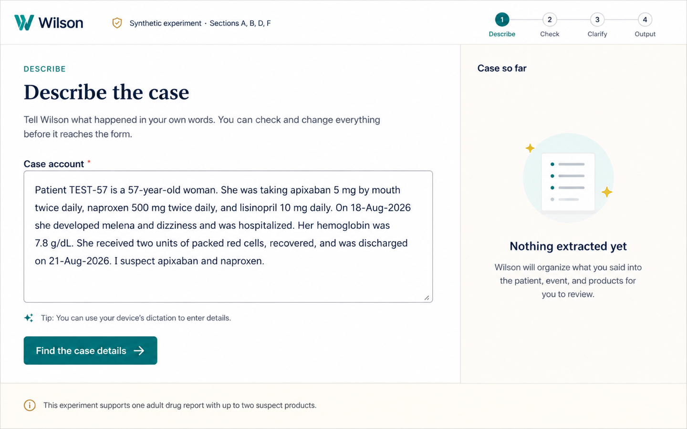
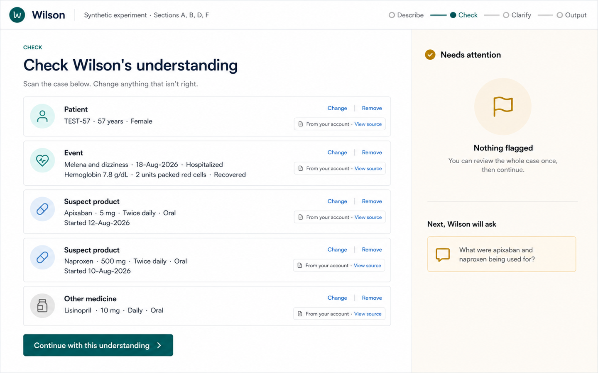
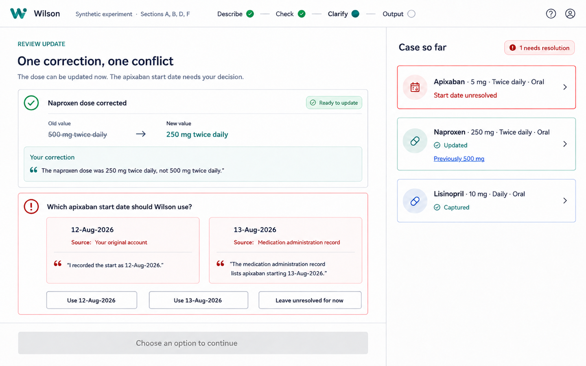
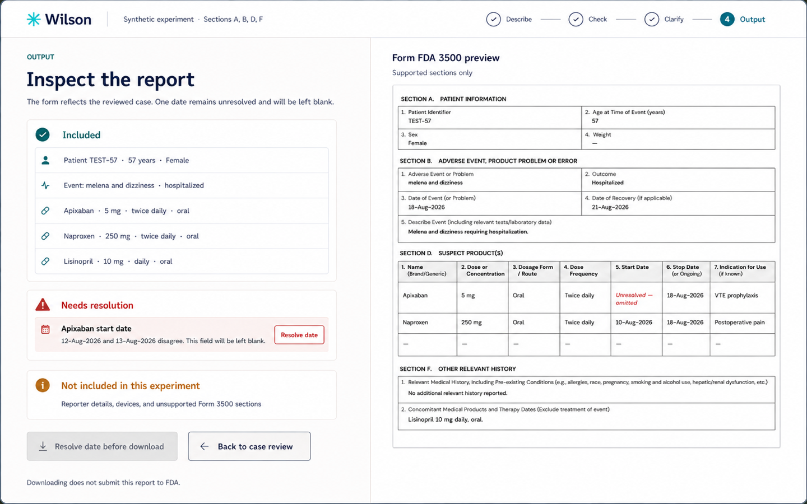

# Wilson experiment 1 visual checkpoint

**Status:** Approved by Steve on 2026-09-04 as the Experiment 1 visual hypothesis; not implementation or product-acceptance authority
**Viewport:** 1440 x 900 desktop
**Fixture:** The fixed synthetic multi-product journey in
[`EXPERIMENT-1-PROPOSAL.md`](../../EXPERIMENT-1-PROPOSAL.md)
**Purpose:** Make the experiment's composition and friction hypotheses visible
before production code

These four realistic mockups are deliberately bounded design artifacts. They
show one possible visual expression of the confirmed product and proposed
experiment. They do not define a component library, responsive behavior,
complete Form FDA 3500 coverage, or usability acceptance.

## Shared composition

- The active task and current case remain visible without a Form 3500 section
  rail.
- The clinician begins with a natural account rather than form fields.
- Review is organized as patient, event, and distinct product groups.
- Ordinary groups can be scanned together and continued once; only flagged
  corrections, uncertainty, role ambiguity, or conflict require a separate
  decision.
- Evidence is compact by default and expands where it affects a decision.
- The PDF is a downstream projection shown prominently only during output
  inspection.
- The warm neutral, navy, teal, and gold treatment is a candidate continuation
  of Warbler's brand character, not approval of legacy Wilson's application
  layout or CSS.

## 1. Describe

**What the clinician does:** supplies one natural case account and asks Wilson
to find the case details.

**Friction removed:** no paper-field navigation, repeated entry, or need to
decide where each fact belongs.

**Deliberate friction:** the experiment boundary is visible before processing;
the clinician has not authorized any extracted knowledge yet.

**Static image cannot prove:** text editing, loading, keyboard behavior,
provider failure, or whether the extraction is accurate.

## 2. Check understanding

**What the clinician does:** scans five semantic groups, changes or removes an
incorrect group if necessary, and continues once with the overall
understanding.

**Friction removed:** no separate `Looks right` click for every ordinary group;
products and their attributes remain visibly distinct; source details are
available without dominating the page.

**Deliberate friction:** the AI output is presented as reviewable knowledge,
not silently accepted case state.

**Static image cannot prove:** whether users notice errors, whether five groups
fit at realistic variation, or whether the combined indication question is
clear.

## 3. Correct and resolve

**What the clinician does:** sees the naproxen correction applied visibly and
makes an explicit decision about two conflicting apixaban dates, including the
honest option to leave the date unresolved.

**Friction removed:** the correction is made once, the old value remains
traceable, and both pieces of date evidence are brought to the decision.

**Deliberate friction:** Wilson cannot use an overall continue action to hide or
resolve the conflict.

**Static image cannot prove:** atomic writes, supersession behavior, focus
management, or whether choosing an option updates every view consistently.

## 4. Inspect output

**What the clinician does:** compares the reviewed semantic result with the
supported Form 3500 projection and sees exactly why the unresolved start date
will be omitted.

**Friction removed:** the form is no longer the primary data-entry surface, and
included, unresolved, and unsupported material is summarized before download.

**Deliberate friction:** unresolved material remains conspicuous and directly
actionable; downloading is not described as FDA submission.

**Static image cannot prove:** official PDF fidelity, projection equality,
download behavior, or whether a clinician can detect a deliberately seeded
mismatch. The paper rendering is a composition facsimile, not a validated Form
3500 mapping.

## Cognitive walkthrough

For each screen, review without explanation and ask:

1. What would you do next?
2. What does Wilson currently believe?
3. What, if anything, requires your attention?
4. How would you correct it?
5. What will reach Form FDA 3500?

A confusing answer changes the composition before implementation; it is not
deferred as frontend polish.

## Approval boundary

Review of this checkpoint should decide only whether to retain or revise:

1. the active-work plus case-context composition;
2. one case-level continuation for ordinary extracted knowledge;
3. compact evidence with automatic expansion for flagged knowledge;
4. the correction and conflict treatment;
5. delaying the prominent form preview until output; and
6. the degree of Warbler visual-family resemblance.

Approval of these mockups still requires the other experiment approval items.
The images do not authorize implementation by themselves.

## Rendering caveats

These are generated visualizations, not hand-authored interface specifications.
Decorative marks, icons, exact type metrics, and small spacing differences are
placeholders. In particular, the varying header symbols are not Wilson logo
proposals. Product decisions should be made from the labeled composition and
interaction hypotheses, not by copying pixels from these images.
